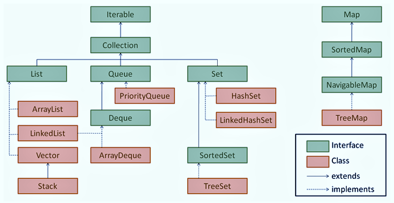

Collections in Java are a set of classes and interfaces provided by the Java Collections Framework (JCF) that facilitate the management and manipulation of groups of objects. This framework offers a wide range of data structures, algorithms, and utility methods to work with collections effectively. 

1. **Interfaces and Implementations:**

   
2. **Advantages:**
   - Collections provide dynamic sizing, automatic resizing, and built-in functionality for common operations like searching, sorting, and filtering. 
   - They abstract away low-level data structure details, making it easier to manage and manipulate data.
3. **Generics:**
   - Collections in Java make extensive use of generics (introduced in Java 5) to ensure type safety and enable the use of parameterized types.
4. **Common Methods:**
   - Collections offer common methods like add(), remove(), contains(), size(), isEmpty(), and more, depending on the specific interface.